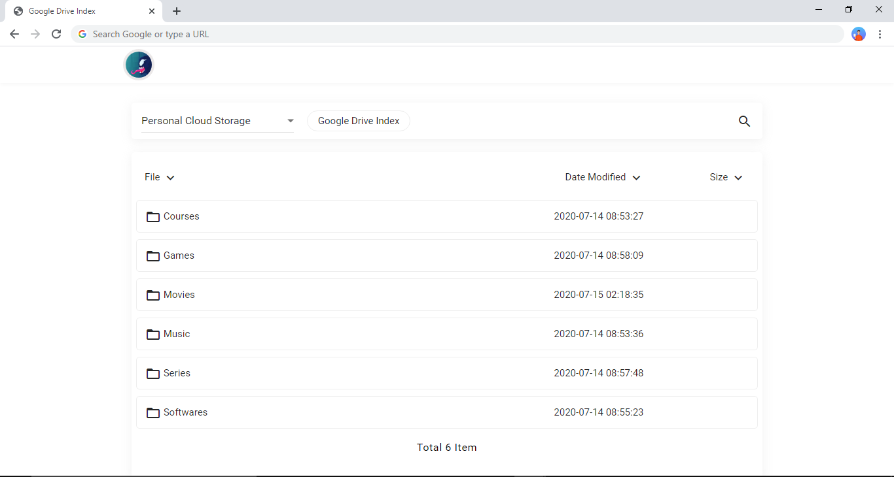

<h1 align="center">Google Drive Index 🔥</h1> 

<hr>

> ## A Google Drive Index Running on CloudFlare ❤️ Workers.

<p align="center"></p>

Supports features such as multi-disk, search, pagination and call-to-external player, plus DPlayer playback.

### Manual Method to generate Client ID, Client Secret and Refresh Token

* Open https://console.developers.google.com/apis/credentials
* After creating project or if you already have one.
* Click create credentials.
* Select OAuth client ID.
* Select Web application.
* Give it a name. (anything for your own reference)
* In Authorized JavaScript origins add https://developers.google.com
* In Authorized redirect URIs add https://developers.google.com/oauthplayground
* Save and note down your Client ID and Secret
* Open https://developers.google.com/oauthplayground
* On Right Top Side click on Setting Icon 
* Click on Use your own OAuth credentials.
* Enter OAuth Client ID: and OAuth Client secret:
* Now back to same page https://developers.google.com/oauthplayground left side Step 1 i.e. Select & authorize APIs
* Find Drive API v3
* Select First Option i.e. https://www.googleapis.com/auth/drive
* Click on Authorize API. and give permissions using your google account.
* It will turn to Step 2 Exchange authorization code for tokens at the end of authentication.
* Click on Exchange authorization code for tokens, if it goes to step 3, click on Step 2 yourself.
* Select the option Auto-refresh the token before it expires.

### Extra Options
``` js
const uiConfig = {
  .......
  "avatar": "https://i.ibb.co/jW0TDZH/image.png",  // Changes the avatar image in the navbar
  "disable_navicon": true // Disables useless nav menu in navbar
  .......
};
```
### Credits:

- [5MayRain](https://github.com/5MayRain) 
